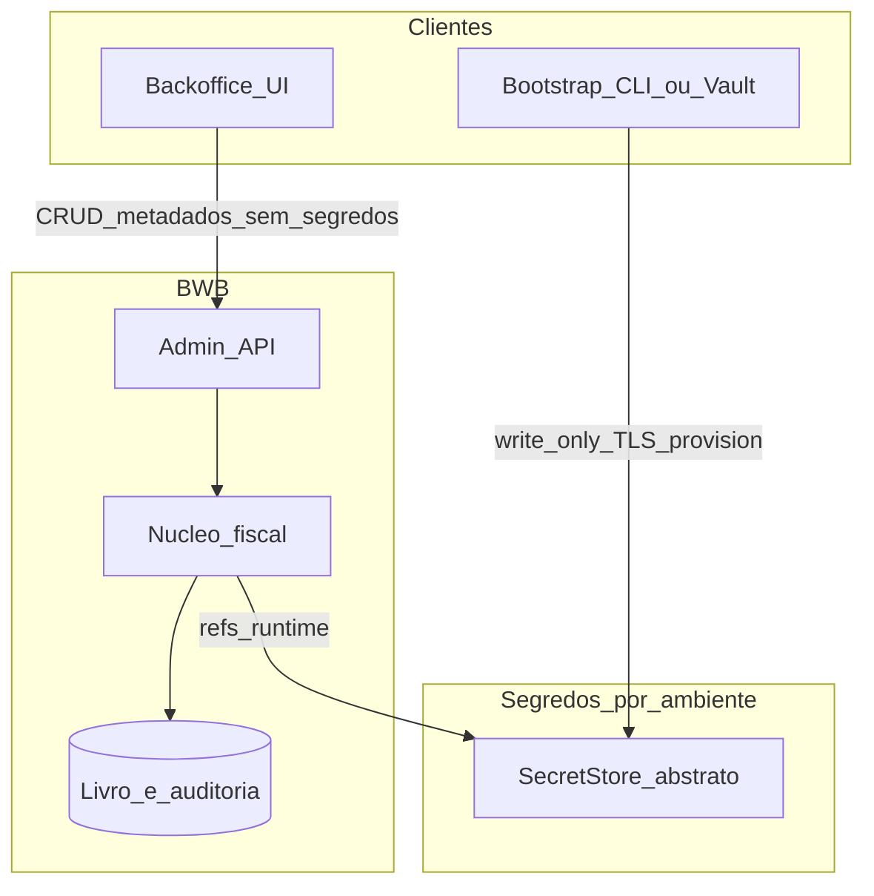

# Arquitetura do backoffice operacional

**Estado:** formalizado (não implementado)
**Âmbito:** Fase 2 do roadmap — fora do primeiro vertical slice
**Stack:** alinhada a DEC-STACK-001 (API no monólito Go; UI posterior)

## Posição no sistema

O backoffice (portal operacional) configura e observa; o núcleo fiscal permanece a autoridade de emissão e numeração. Contrato admin separado do POS. Sem microserviços.

`SecretStore` abstrai Secret Manager / KMS / HSM. Fornecedor e capacidade de importação ainda não decididos.

## Credenciais AGT (três mecanismos)

| Conceito | Âmbito | Notas |
|---|---|---|
| `ProducerCredential` | Plataforma BWB/produtor + ambiente | Basic Auth AGT do produtor; não pertence a tenant/contribuinte |
| `ProducerKeyRef` | Plataforma BWB/produtor + ambiente | Par RSA do produtor; privada sob custódia do produtor |
| `TaxpayerKeyRef` | Contribuinte + ambiente | Par RSA do contribuinte (`jwsDocumentSignature` / `jwsSignature`); só no `SecretStore` da plataforma se DEC-REG-KEY-CUSTODY permitir |

Documentação FE pública (snapshot/confirmação em homologação; **não** substitui artefactos restritos):

- https://quiosqueagt.minfin.gov.ao/doc-agt/faturacao-electronica/1/api.html
- https://quiosqueagt.minfin.gov.ao/doc-agt/faturacao-electronica/1/gestao.html
- https://quiosqueagt.minfin.gov.ao/doc-agt/faturacao-electronica/1/servicos/registar.html

## Regras de segurança (resumo)

- UI sem material secreto; em produção, bootstrap separado (CLI/agente/vault) write-only por TLS para o `SecretStore`.
- Homologação e produção isolados.
- Proibida cópia automática de chaves privadas cloud↔Edge; provisionamento explícito, autenticado e auditado.
- Fingerprints só a partir de chave pública ou metadados seguros do provisionamento.
- Autorização do contribuinte **necessária** mas **insuficiente** sem permissão oficial AGT — ver DEC-REG-KEY-CUSTODY.
- Se custódia externa for proibida: chave só no ambiente do contribuinte/Edge ou mecanismo oficial de delegação/assinatura remota.

## Edge e assinatura (aberto)

Opções E1 (assinatura só cloud), E2 (chave no keystore Edge), E3 (assinatura remota via `SecretStore`) — decisão DEC-SEC-EDGE-KEYS, dependente de contingência oficial e de DEC-REG-KEY-CUSTODY.

## Fases de entrega

1. Fundações administrativas (sem frontend).
2. API administrativa.
3. Backoffice mínimo (UI).
4. Funcionalidades fiscais avançadas (séries, documentos, falhas, reconciliação, SAF-T, exportações) — após decisões bloqueantes e pacote AO.

## Referências

- [domain-model.md](../04-domain/domain-model.md)
- [security-baseline.md](../05-security/security-baseline.md)
- [open-decisions.md](../06-delivery/open-decisions.md) (DEC-REG-KEY-CUSTODY, DEC-SEC-EDGE-KEYS)
- [regulatory-gaps.md](../01-compliance/regulatory-gaps.md) (GAP-013)
- [implementation-roadmap.md](../06-delivery/implementation-roadmap.md) (Fase 2)
- [system-architecture.md](system-architecture.md)
