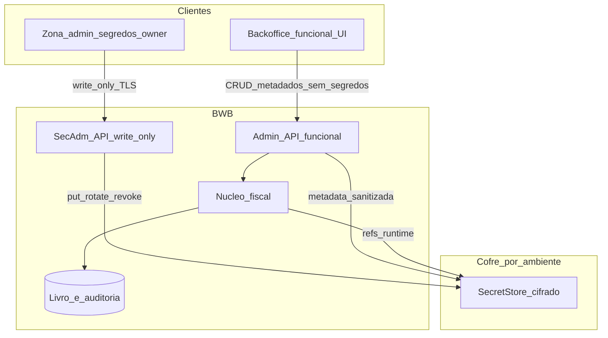

# Arquitetura do backoffice operacional

**Estado:** formalizado (DEC-BO-001…004); API admin + UI SSR `RM-UI-001`…`RM-UI-004` (M7 mínimo); preparação autoridade AGT `RM-AGTPREP-*` (sem integração real)
**Âmbito:** ops administrativas — fora do primeiro vertical slice POS
**Stack:** DEC-STACK-001 — API + UI no monólito Go (`html/template` + `embed`); **sem** SPA/npm

## Posição no sistema

O backoffice configura e observa; o núcleo fiscal permanece a autoridade de emissão e numeração. Contrato admin **separado** do POS: prefixo **`/admin/v1`**, OpenAPI [`specs/admin/openapi.yaml`](../../specs/admin/openapi.yaml) (`0.1.0-draft`→`0.1.6-draft`; ≠ POS `0.1.x`). Auth operadores OIDC/JWT RBAC (`owner|admin|operator|auditor`) via `adminauth` (`oidc_jwt` / DEC-BO-003); só `owner` em SecAdm. UI browser: sessão opaca servidor (`RM-UI-005` — cookie HttpOnly/SameSite; Bearer só na troca servidor; sem JWT em localStorage). Sem microserviços.

```mermaid
flowchart TB
  subgraph clients [Clientes]
    AdminUI[Backoffice_funcional_UI]
    OwnerVault[Zona_admin_segredos_owner]
  end
  subgraph bwb [BWB]
    AdminAPI[Admin_API_funcional]
    SecAdmAPI[SecAdm_API_write_only]
    FiscalCore[Nucleo_fiscal]
    Ledger[(Livro_e_auditoria)]
  end
  subgraph secrets [Cofre_por_ambiente]
    SecretStore[SecretStore_cifrado]
  end
  AdminUI -->|"CRUD_metadados_sem_segredos"| AdminAPI
  OwnerVault -->|"write_only_TLS"| SecAdmAPI
  SecAdmAPI -->|"put_rotate_revoke"| SecretStore
  AdminAPI -->|"metadata_sanitizada"| SecretStore
  AdminAPI --> FiscalCore
  FiscalCore --> Ledger
  FiscalCore -->|"refs_runtime"| SecretStore
```

## Dois planos (DEC-BO-001)

| Plano | Quem | Gere | Segredos |
|---|---|---|---|
| **A — Backoffice funcional** | Operadores autorizados | Contribuintes, estabelecimentos, scopes/bindings, séries/config não secreta, estados, auditoria | **Nunca** legíveis nem exibidos |
| **B — Zona admin integração/segredos** | Owner (Jorge) exclusivo | Provisionamento AGT/chaves/tokens/URLs privadas, rotação, HML≠PRD | Write-only; cofre cifrado; auditado |

### Plano A — permitido

- Cadastros: `Taxpayer`, `Establishment`, bindings de scope POS.
- Adesão FE do contribuinte: enum `not_enrolled|pending|active|suspended` por ambiente (`DEC-PROD-004` / `RM-BO-012`); **nunca** booleano; `active` ≡ aderiu facturação electrónica nesse ambiente; NIF proibido em logs/métricas/audit `resource_id`.
- Disponibilidade documental calculada (`RM-BO-013` / `DEC-PROD-001`…`006`): 5 grupos; activos; SAF-T sem FE; matriz FE com adesão `active`; pendências AGT (`pending_validation`/`conflito`) indisponíveis; sem inventar códigos.
- Séries por estabelecimento/ambiente/tipo (`RM-BO-014`): `draft`/`active`/`closed`; código único; sem reutilizar/retroceder; concorrência por versão; metadados ≠ numeração fiscal.
- Fila ops de submissões (`RM-BO-015`/`016`/`017`): estados derivados, acções seguras, dashboard com contagens/alertas, filtros e paginação — sem payload/JWS/NIF.
- Séries efectivas no binding (`series_effective_code`), timezone IANA, activação de tipos/grupos, estados (`active`/`inactive`).
- Listagens de submissões/erros/reconciliação **sem** corpos secretos.
- Metadados sanitizados de refs: ambiente, estado, fingerprint, validade, última verificação.

### Plano A — proibido

Credenciais AGT, chaves privadas, passwords, tokens em claro, DSN/URLs privadas de override, qualquer `GET` de segredo.

### Plano B — obrigatório

- Write-only (sem retorno do valor); storage cifrado; auditoria; rotação/revogação; isolamento HML/PRD.
- Endpoints **públicos** documentados = configuração técnica versionável.
- Overrides **privados** = apenas no cofre operacional (nunca no backoffice comum nem em ficheiros públicos do repo).

`SecretStore` abstrai Secret Manager / KMS / HSM. Fornecedor KMS/HSM concreto ainda não decidido. Scaffolding actual (`RM-AGTPREP-014`):

- **`durable_encrypted`**: ciphertext AES-256-GCM na tabela `secret_store_entries` + master key externa (`FISCAL_SECRETSTORE_MASTER_KEY`); sem plaintext em BD.
- **`ephemeral_memory`**: só `FISCAL_ENV=development` / testes; chave de processo efémera.
- Homologação/produção técnicas BWB: fail-closed sem master key. **≠** credenciais AGT reais.

## Credenciais AGT (três mecanismos)

| Conceito | Âmbito | Notas |
|---|---|---|
| `ProducerCredential` | Plataforma BWB/produtor + ambiente | Basic Auth AGT do produtor; **só plano B** |
| `ProducerKeyRef` | Plataforma BWB/produtor + ambiente | Par RSA do produtor; privada no cofre |
| `TaxpayerKeyRef` | Contribuinte + ambiente | Par RSA do contribuinte; só no `SecretStore` se DEC-REG-KEY-CUSTODY permitir |
| Adesão FE (estado) | Contribuinte + ambiente | `not_enrolled` \| `pending` \| `active` \| `suspended` (`DEC-PROD-004`); **plano A** (enum, não segredo) |
| Séries / activação tipos | Estabelecimento (+ config POS) | Configuração não secreta (`DEC-PROD-003`/`004`) |

Documentação FE pública (snapshot/confirmação em homologação; **não** substitui artefactos restritos):

- https://quiosqueagt.minfin.gov.ao/doc-agt/faturacao-electronica/1/api.html
- https://quiosqueagt.minfin.gov.ao/doc-agt/faturacao-electronica/1/gestao.html
- https://quiosqueagt.minfin.gov.ao/doc-agt/faturacao-electronica/1/servicos/registar.html

## Regras de segurança (resumo)

- UI plano A sem material secreto; plano B bootstrap write-only por TLS para o `SecretStore`.
- Homologação e produção isolados.
- Proibida cópia automática de chaves privadas cloud↔Edge; provisionamento explícito, autenticado e auditado.
- Fingerprints só a partir de chave pública ou metadados seguros do provisionamento.
- Autorização do contribuinte **necessária** mas **insuficiente** sem permissão oficial AGT — ver DEC-REG-KEY-CUSTODY.
- Se custódia externa for proibida: chave só no ambiente do contribuinte/Edge ou mecanismo oficial de delegação/assinatura remota.
- Constraints de produto (`DEC-PROD-012`): segregação por contribuinte; non-exportable quando possível; **nunca nos POS**; rotação auditada; fecho definitivo aguarda AGT.

## Edge e assinatura (aberto)

Opções E1 (assinatura só cloud), E2 (chave no keystore Edge), E3 (assinatura remota via `SecretStore`) — decisão DEC-SEC-EDGE-KEYS, dependente de contingência oficial e de DEC-REG-KEY-CUSTODY.

## Fases de entrega

1. Decisão/arquitectura da separação (`DEC-BO-001` / `RM-ARCH-006`) — concluído.
2. Fundação backend cadastros (`RM-BO-010`) — concluído.
3. Contrato write-only + cofre (`RM-SECADM-002`) + gate owner-only (`RM-SECADM-001`) + persistência cifrada (`RM-AGTPREP-014`) — concluídos; KMS/HSM e AGT real ainda futuros.
4. Superfície Admin API (`DEC-BO-002` / `RM-BO-001`) — `/admin/v1` cadastros + auth injectável fail-closed + audit append-only; IdP real e UI ainda futuros.
5. Séries/config não secreta, visibilidade ops, matriz permissões (`RM-BO-002`/`003`/`004`).
6. UI backoffice mínimo (M7 / `RM-ARCH-005`): SSR em `/admin/ui/` — `RM-UI-001` shell/dashboard read-only; `RM-UI-002` mutações; `RM-UI-003` ops/audit; `RM-UI-004` SecAdm metadados; `RM-SAFT-022` estado SAF-T estrutural read-only (`/admin/ui/saft`, sem XML fiscal); `RM-AGTPREP-003` perfis autoridade owner-only (`/admin/ui/authority-profiles`, metadados + readiness sanitizado); `RM-AGTPREP-008` wizard owner-only (3 passos, permanece `draft`).
7. Preparação autoridade AGT no backoffice (`DEC-BO-004` / `RM-AGTPREP-*`): perfis públicos + SecAdm para material criptográfico; **sem** chamada AGT real; `external_verified=false`; wizard não activa nem marca verificação externa; activação (`active`) fail-closed exige readiness local (`RM-AGTPREP-009`).
8. Funcionalidades fiscais avançadas — após decisões bloqueantes e pacote AO.

### Preparação autoridade AGT (`DEC-BO-004`)

| Camada | Superfície | Conteúdo | Segredos |
|---|---|---|---|
| Perfil / metadados | Admin API + UI operacional (mutação owner) `/admin/ui/authority-profiles` · hub `/admin/ui/agt-settings` | `AuthorityProfile`, endpoints/operation keys conhecidos ou `pending_external`, estados, readiness, catálogo FE, scaffold JWS | **Nunca** |
| Material criptográfico | SecAdm owner-only → `SecretStore` (`/admin/v1/secadm/material` + UI `/admin/ui/secadm/material`) | Credencial produtor, chave, certificado/PKCS#12 | Write-only; password efémera não persistida; limites de tamanho |
| Probe externa | Reservada | Ligação AGT real | Bloqueada até GAP-006 / `RM-FE-001` |

Hub owner-only (`RM-AGTPREP-015`…`022`): consolida selecção HML/PRD, catálogo de endpoints (URLs só alinhadas; C-FE-001 sem URL), scaffold JWS (`claims_status=pending_external`), inventário SecretStore mascarado, estado sanitizado da master key (fingerprint), estado do gate SecAdm (`present`/`absent` sem subject), conectividade com probe CSRF no hub (só simulador; fail-closed), e validação de bindings (ops+refs) por perfil — **fora** do nav operacional comum.

Readiness canónico (checklist): `config_ready` · `secrets_ready` · `offline_validated` · `external_verified` (**fix** até AGT real).

### UI (RM-UI-*)

| Princípio | Escolha |
|---|---|
| Render | Server-side Go templates (sem React/Vue) |
| Auth | Mesmo `adminauth.Authenticator` que `/admin/v1`; produção fail-closed |
| Dados | Mesmo `adminregistry` / ops (contrato admin); sem Bearer no browser |
| CSP | `default-src 'none'; style-src 'self'; …` — sem scripts no slice 1 |
| CSRF | Cookie HttpOnly + campo form one-time (`RM-UI-002`); SameSite=Strict |
| Segredos | Nunca no HTML/logs/cookies |
| Observabilidade | `adminobs` — health/ready/metrics; `X-Request-Id`; logs sanitizados (RM-BO-007) |

## Referências

- [domain-model.md](../04-domain/domain-model.md)
- [security-baseline.md](../05-security/security-baseline.md)
- [open-decisions.md](../06-delivery/open-decisions.md) (`DEC-BO-001`…`004`, DEC-REG-KEY-CUSTODY, DEC-SEC-EDGE-KEYS)
- [regulatory-gaps.md](../01-compliance/regulatory-gaps.md) (GAP-013)
- [ROADMAP.md](../../ROADMAP.md)
- [admin-observability.md](../07-operations/admin-observability.md) (RM-BO-007)
- [system-architecture.md](system-architecture.md)
