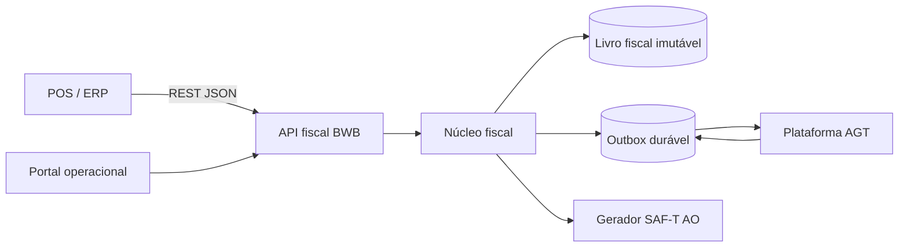

# Arquitetura do sistema

## Contexto

## Estilo arquitetural inicial

Monólito modular para o núcleo fiscal, com workers separados para transmissão, webhooks e exportações. Evitar microserviços até existir necessidade operacional comprovada.

## Módulos

- Identidade e tenancy.
- Empresas, estabelecimentos, terminais e integradores.
- Documentos canónicos e validação.
- Regras fiscais Angola.
- Séries e numeração.
- Cálculo fiscal.
- Criptografia e gestão de chaves.
- Livro fiscal e auditoria.
- Outbox e conector AGT.
- Contingência e reconciliação.
- SAF-T (AO).
- Webhooks.
- Administração e suporte.

## Cloud

Plano de controlo, API, base de dados transacional, armazenamento de artefactos, workers e observabilidade. Serviços devem ser redundantes; números e idempotência dependem de transações fortes.

## Edge Linux

API local, núcleo fiscal, base de dados durável, fila de sincronização, gestor de chaves, diagnóstico e atualizador assinado. O Edge deve operar sem a cloud durante contingência autorizada e reconciliar automaticamente.

## Regra de paridade

O pacote fiscal e os vetores de teste são comuns. Infraestrutura e armazenamento podem diferir; decisão fiscal não.
