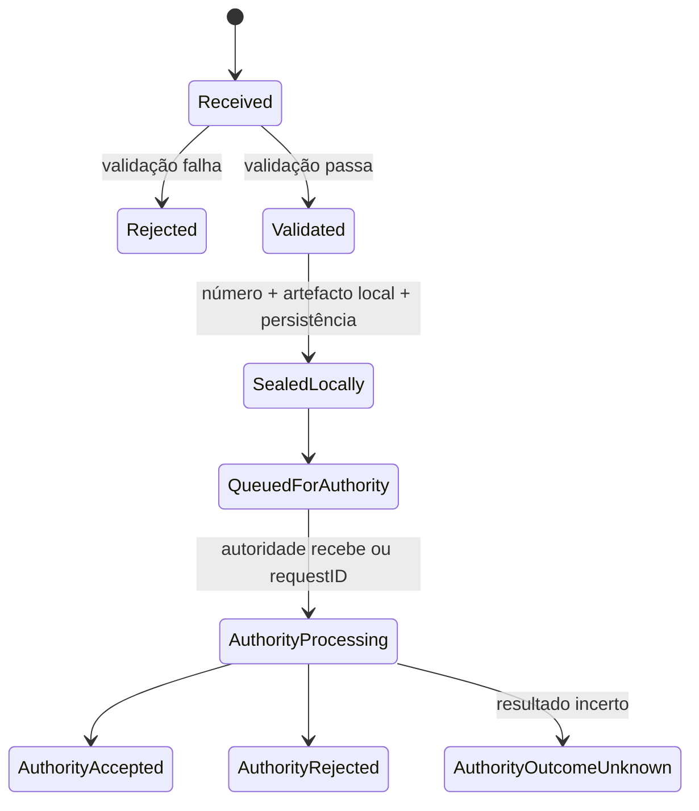

# Máquina de estados documental

Sequência técnica alinhada ao OpenAPI `0.1.1-draft` (tarefa zero). DEC-API-004 permanece aberta para a semântica jurídica de emissão/aceitação.

## Regras

- Transições são append-only e auditadas.
- `sealed_locally` não afirma por si emissão fiscal jurídica perante a AGT (DEC-API-004).
- Estados finais fiscais não são revertidos por atualização direta.
- Rejeição da autoridade não autoriza automaticamente reutilização do número.
- Reprocessamento cria nova tentativa de submissão, não novo documento.
- `authority_outcome_unknown` exige reconciliação (entrega at-least-once / resultado desconhecido).
- `contingency_pending` existe no contrato OpenAPI como **reservado**; o primeiro vertical slice **não** implementa transição para este estado; regras oficiais de contingência (`AO-OFF-*`, DEC-REG-004) permanecem abertas — não inventar o fluxo aqui.
- Retificação/anulação é um comando legal separado, com referência ao original; `cancelled` não está no contrato (DEC-API-002).
