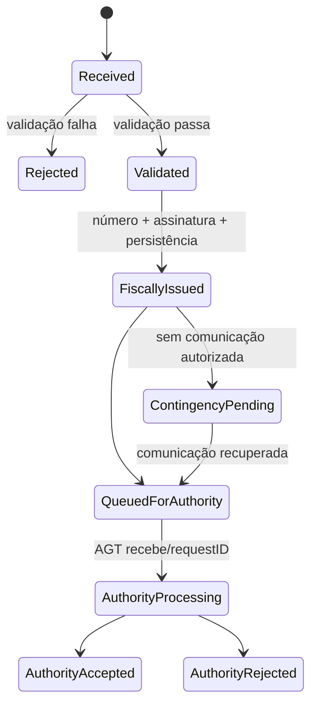

# Máquina de estados documental

## Regras

- Transições são append-only e auditadas.
- Estados finais fiscais não são revertidos por atualização direta.
- Rejeição da AGT não autoriza automaticamente reutilização do número.
- Reprocessamento cria nova tentativa de submissão, não novo documento.
- Retificação/anulação é um comando legal separado, com referência ao original.
