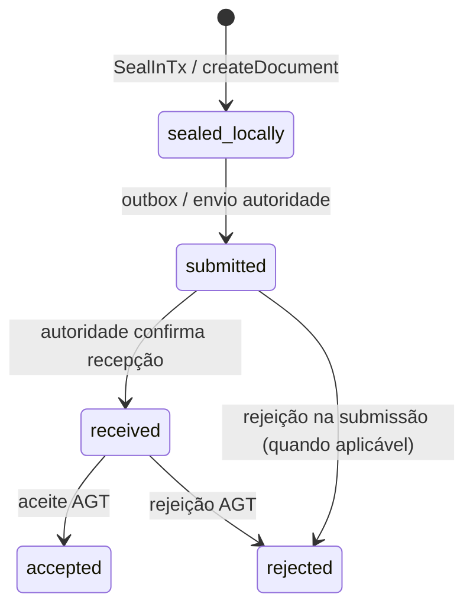

# Máquina de estados documental

**Decisão de produto:** [`DEC-PROD-009`](../06-delivery/open-decisions.md) — estados de ciclo de vida vs AGT.
`DEC-API-004` permanece aberta para a semântica jurídica de «emissão fiscal».
OpenAPI actual (`createDocument`) expõe `sealed_locally`; restantes estados na revisão contratual formal.

## Estados de produto (canónicos)

| Estado | Rótulo PT | Afirma aceitação AGT? |
|---|---|---|
| `sealed_locally` | selado localmente | **Não** |
| `submitted` | enviado | **Não** |
| `received` | recebido | **Não** |
| `accepted` | aceite | **Sim** (só este) |
| `rejected` | rejeitado | **Não** (rejeição) |

```mermaid
stateDiagram-v2
  [*] --> sealed_locally: SealInTx / createDocument
  sealed_locally --> submitted: outbox / envio autoridade
  submitted --> received: autoridade confirma recepção
  received --> accepted: aceite AGT
  received --> rejected: rejeição AGT
  submitted --> rejected: rejeição na submissão (quando aplicável)
```

## Subestados técnicos (implementação)

Podem existir para reconciliação/retry **sem** antecipar `accepted`:

- `queued_for_authority` — fila outbox (sob `submitted` / pré-envio)
- `authority_outcome_unknown` — resultado incerto; exige reconciliação → `received` / `accepted` / `rejected` / re-`submitted`
- `contingency_pending` — reservado no OpenAPI; outbox/reenvio/idempotência ok (`DEC-PROD-010`); **sem** emissão offline certificada até `DEC-REG-004` / `AO-OFF-*`

## Regras

- Transições são append-only e auditadas (`DEC-PROD-013`); retenção final aguarda norma consolidada.
- **Proibido** afirmar aceitação fiscal antes de `accepted` (`DEC-PROD-009`).
- `sealed_locally` ≠ emissão/aceitação AGT; HTTP 2xx não autoriza o POS a declarar aceite.
- Proibido `fiscally_issued` como sinónimo de selagem local.
- Estados finais fiscais (`accepted` / `rejected` após autoridade) não são revertidos por atualização directa.
- Rejeição da autoridade não autoriza automaticamente reutilização do número.
- Retry a partir de resultado incerto usa o **mesmo identificador estável de submissão**; **não** cria novo documento nem nova selagem.
- Reprocessamento/reconciliação cria nova **tentativa** de submissão (mesmo documento e mesma selagem).
- Retificação/anulação é comando legal separado; `cancelled` fora do contrato até `DEC-API-002`.
- Offline técnico ≠ contingência certificada (`DEC-PROD-010`).
