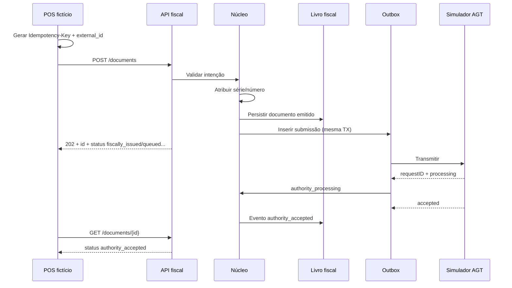

# Primeiro vertical slice — especificação (Fase 0)

**Data:** 2026-07-20  
**Estado:** especificação para implementação na **Fase 1** (não implementar na Fase 0)  
**Premissa:** `ASM-REG-001` — o módulo é a única autoridade de emissão/numeração  
**Requisitos âncora:** `AO-ID-001`, `AO-DOC-001`, `AO-DOC-002`, `AO-SEQ-001`, `AO-SEQ-002`, `AO-IDEM-001`, `AO-AGT-002`, `AO-AUD-001`

Documentos relacionados:

- [phase-0-execution-plan.md](phase-0-execution-plan.md)
- [document-state-machine.md](../04-domain/document-state-machine.md)
- [api-guidelines.md](../03-api/api-guidelines.md)
- [testing-strategy.md](testing-strategy.md)
- [openapi.yaml](../../specs/openapi/openapi.yaml) (esqueleto; mudanças só com justificação)

## Objetivo da demonstração

Provar, de ponta a ponta e de forma **repetível**, que um POS fictício consegue:

1. submeter uma intenção de fatura;
2. obter validação;
3. garantir idempotência;
4. receber série/número atribuídos **apenas** pelo módulo;
5. persistir no livro fiscal imutável;
6. enfileirar transmissão via outbox;
7. observar estados distintos de receção vs aceitação pela autoridade;
8. fazê-lo contra um **simulador AGT**, não contra a integração oficial.

## Âmbito incluído

```text
POS fictício → API fiscal (/v1/documents)
            → validação de schema/regras mínimas
            → Idempotency-Key + external_id
            → série + número (módulo)
            → livro fiscal (append-only)
            → outbox durável
            → simulador AGT (requestID + estados)
            → GET /documents/{id} e (opcional) webhook assinado de sandbox
```

## Âmbito excluído

- Integração oficial AGT / credenciais reais de homologação.
- Assinatura legal de produção conforme 74/19 (pode existir **stub criptográfico** claramente marcado como não certificado).
- SAF-T (AO) completo (`AO-SAF-*`).
- Portal operacional completo.
- Contingência Edge completa (`AO-OFF-*`) — apenas ganchos de estado `contingency_pending` se trivial; senão, adiar com nota.
- Nota de crédito, anulações, múltiplos impostos complexos.
- Microserviços.
- Cabo Verde.

## Atores e componentes

| Componente | Papel |
|---|---|
| POS fictício | Cliente HTTP; nunca atribui número fiscal; persiste `Idempotency-Key` antes do POST |
| API fiscal | Contrato `/v1`; autenticação de máquina de sandbox |
| Núcleo | Validação, numeração, persistência, transição de estados |
| Livro fiscal | Registo imutável do documento emitido |
| Outbox | Mensagem durável criada na mesma transação da emissão |
| Simulador AGT | Aceita submissão, devolve `requestID`, simula accepted/rejected/lento/indisponível |
| Observabilidade | Correlação `request_id` / document id / attempt id sem payload fiscal completo |

## Fluxo feliz (aceitação)



Estados esperados alinhados à máquina de estados e ao OpenAPI atual (exceto contradições documentadas em [phase-0-execution-plan.md](phase-0-execution-plan.md)):

`received → validated → fiscally_issued → queued_for_authority → authority_processing → authority_accepted`

## Critérios de aceitação

### Funcionais

1. O POS demo emite uma fatura simples em AOA com pelo menos uma linha e obtém `fiscal_number` não enviado no pedido.
2. O campo `requested_series` (se presente) é apenas referência; o número final é do módulo (`AO-SEQ-002`).
3. O documento persistido não é editável via API (`AO-DOC-002`).
4. `GET` devolve o mesmo resultado estável após emissão.
5. Existe pelo menos um evento de auditoria por transição relevante (`AO-AUD-001`).
6. A outbox contém a tentativa com payload de submissão e resposta do simulador preservados (metadados; sem log operacional completo em claro se sensível).
7. O status distingue emissão fiscal local de aceitação do simulador (`AO-AGT-002`).

### Não funcionais / qualidade

8. Suite automatizada reproduz o fluxo em CI.
9. Relatório de teste referencia IDs `AO-*` acima.
10. Nenhuma credencial real AGT, chave privada ou NIF real de produção nos artefactos.
11. OpenAPI do slice permanece compatível com o esqueleto ou documenta breaking change justificada (Fase 1).

## Cenários obrigatórios de falha e concorrência

| ID | Cenário | Comportamento esperado |
|---|---|---|
| VS-T01 | Timeout de rede após o servidor processar | Cliente reenvia **a mesma** `Idempotency-Key`; não há segunda emissão (`AO-IDEM-001`) |
| VS-T02 | Timeout antes de qualquer processamento | Reenvio com a mesma chave cria no máximo um documento |
| VS-T03 | Duplicação com mesma chave e mesmo body | Resposta idempotente equivalente (mesmo `id` / `fiscal_number`) |
| VS-T04 | Mesma chave com body diferente | `409` conflito explícito |
| VS-T05 | Mesmo `external_id` com chave diferente | Conflito ou política documentada; sem dois números fiscais para a mesma intenção |
| VS-T06 | Duas chamadas concorrentes mesma série | Numeração única e sequencial; sem buracos causados por race mal tratada (`AO-SEQ-001`) |
| VS-T07 | Falha após commit do livro e antes do outbox | **Não deve ocorrer** se outbox for co-transacional; teste prova a invariante |
| VS-T08 | Simulador indisponível | Documento permanece emitido; outbox retenta com backoff; estado não «aceite» |
| VS-T09 | Simulador lento | `authority_processing`; POS não reemite |
| VS-T10 | Simulador rejeita | `authority_rejected`; número **não** é reutilizado automaticamente |
| VS-T11 | Callback/duplicado do simulador | Processamento idempotente da resposta |
| VS-T12 | Reinício do processo worker no meio da tentativa | Exactly-once efetivo na autoridade simulada **ou** deduplicação por `requestID` |

## Distinção: simulador AGT vs integração oficial

| Aspeto | Simulador AGT (este slice) | Integração oficial AGT |
|---|---|---|
| Objetivo | Desbloquear desenvolvimento e demos | Homologação e produção |
| Rede | Local/CI | Endpoints HML/PRD oficiais |
| Credenciais | Fictícias / internas | Emitidas pela AGT (cofre) |
| Contrato | Subconjunto estável inspirado na doc pública, versionado internamente | Especificação oficial snapshotada |
| Evidência de conformidade | **Não** constitui prova perante AGT | Testes oficiais + dossier |
| Marcação | Prefixo/config `authority=simulator` | `authority=agt-hml` / `agt-prd` |
| Gate | Suficiente para gate da Fase 1 de demonstração | Necessário para readiness de certificação (Fase 2/3) |

**Regra:** qualquer ecrã, log ou README do demo deve declarar explicitamente «simulador — não é a AGT».

## Dados de teste

- Usar NIFs e nomes **fictícios** de sandbox.
- Vetores em repositório: JSON anonimizados.
- Proibir cópia de credenciais ou documentos reais de `local/` para fixtures.

## Definição de pronto do slice (Fase 1)

- [ ] Fluxo feliz automatizado verde em CI.
- [ ] Cenários VS-T01…VS-T12 implementados ou explicitamente adiados com waiver datado.
- [ ] POS fictício documentado (passos < 15 minutos).
- [ ] Evidência de que o POS não escolhe o número.
- [ ] Separação simulador vs AGT visível na configuração.
- [ ] Sem alteração silenciosa de regras fiscais; requisitos ligados a testes.

## Dependências da Fase 0

- DEC-STACK-001 decidida.
- DEC-REG-003 (tipos documentais) pelo menos para fatura simples.
- Lista de mudanças OpenAPI justificada (CTX-001…CTX-003).
- Simulador especificado ao nível de comportamento (este documento), implementação na Fase 1.
