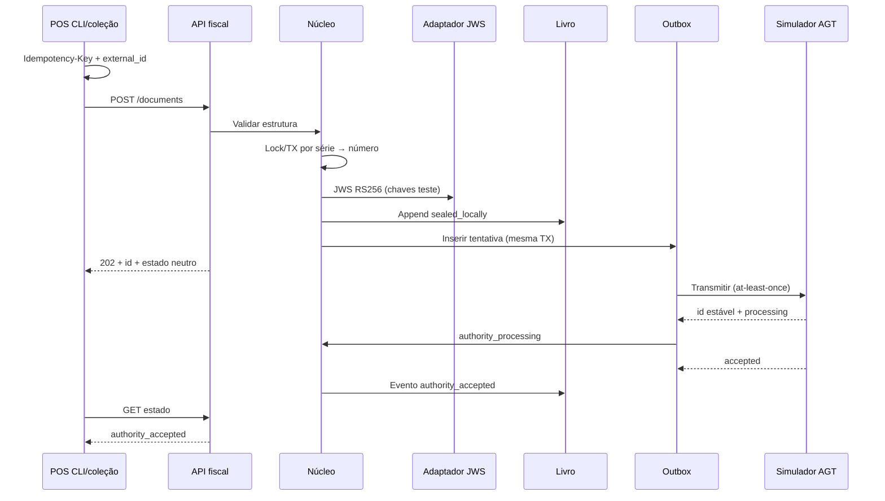

# Primeiro vertical slice — especificação (Fase 0)

**Data:** 2026-07-20  
**Estado:** especificação para implementação na **Fase 1** (não implementar na Fase 0)  
**Premissa:** `ASM-REG-001` — o módulo é a única autoridade de emissão/numeração  
**Requisitos âncora:** `AO-ID-001`, `AO-DOC-001`, `AO-DOC-002`, `AO-SEQ-001`, `AO-SEQ-002`, `AO-IDEM-001`, `AO-CRYPTO-001` (arquitetura), `AO-AGT-002`, `AO-AUD-001`

Documentos relacionados:

- [phase-0-execution-plan.md](phase-0-execution-plan.md)
- [open-decisions.md](open-decisions.md) (DEC-API-004, DEC-STACK-001)
- [technical-stack-proposal.md](technical-stack-proposal.md)
- [document-state-machine.md](../04-domain/document-state-machine.md)
- [api-guidelines.md](../03-api/api-guidelines.md)
- [testing-strategy.md](testing-strategy.md)
- [openapi.yaml](../../specs/openapi/openapi.yaml) (esqueleto; **não alterar** até revisão contratual autorizada)

## Objetivo da demonstração

Provar, de ponta a ponta e de forma **repetível**, com POS demo **CLI ou coleção de requests** (sem UI):

1. submeter uma intenção de fatura;
2. validação estrutural mínima;
3. idempotência;
4. atribuição transacional de série/número **apenas** pelo módulo;
5. selagem local + JWS RS256 com chaves de teste (adaptador; não certificado);
6. persistência append-only no livro;
7. outbox co-transacional;
8. transmissão **at-least-once** ao **simulador AGT** com deduplicação e reconciliação;
9. consulta de estado.

## Âmbito incluído

```text
POS demo (CLI / coleção HTTP)
  → API mínima (/v1) + autenticação sandbox simples
  → validação estrutural mínima
  → Idempotency-Key + external_id
  → série/número (transação por série)
  → JWS RS256 (chaves de teste, adaptador)
  → livro fiscal append-only
  → outbox (payload com controlo de acesso; pode ser cifrado)
  → simulador AGT (at-least-once, id estável, persistência tentativa/resposta)
  → GET estado
```

## Âmbito excluído

- Webhooks (slice posterior).
- Portal / qualquer frontend.
- Aplicação visual POS.
- Contingência Edge completa (`AO-OFF-*`).
- SAF-T (AO).
- Integração oficial AGT / credenciais reais.
- Regras legais do Decreto 74/19 ainda não confirmadas em fonte oficial.
- Stub criptográfico descartável.
- Microserviços.
- Cabo Verde.
- Nota de crédito, anulações, impostos complexos (salvo o mínimo estrutural).

## Atores e componentes

| Componente | Papel |
|---|---|
| POS demo | CLI ou coleção HTTP; nunca atribui número; persiste `Idempotency-Key` antes do POST |
| API fiscal | Contrato mínimo `/v1`; autenticação de máquina de sandbox simples |
| Núcleo | Validação estrutural, numeração, persistência, estados técnicos neutros |
| Adaptador cripto | JWS RS256 real; chaves **exclusivamente de teste**; marcado não certificado |
| Livro fiscal | Append-only do documento selado localmente |
| Outbox | Tentativa + payload necessário (cifrado/ACL); **não** é log operacional |
| Simulador AGT | Aceita submissão, `requestID`/id estável, accepted/rejected/lento/indisponível/desconhecido |
| Logs | Apenas metadados e IDs de correlação |

## Terminologia de estados (até DEC-API-004)

**Não assumir** que «fiscalmente emitido» ocorre antes da aceitação AGT. Até decisão oficial, o slice usa termos **neutros** na implementação e na documentação de testes:

| Termo neutro (slice) | Significado técnico |
|---|---|
| `received` | Pedido aceite para processamento |
| `validated` | Validação estrutural OK |
| `sealed_locally` / `prepared_for_submission` | Número atribuído, persistido, JWS de teste aplicado, pronto para outbox |
| `queued_for_authority` | Na outbox |
| `authority_processing` | Simulador recebeu / em curso |
| `authority_accepted` / `authority_rejected` | Resultado do simulador |
| `authority_outcome_unknown` | Resultado incerto → reconciliação |

O OpenAPI atual pode ainda listar `fiscally_issued`; **não alterar o YAML agora**. Mapear internamente para termos neutros e documentar o mapeamento até DEC-API-004.

## Fluxo feliz (aceitação no simulador)



## Numeração (AO-SEQ-001 / AO-SEQ-002)

Exigir no slice:

- exclusão mútua / transação por série;
- números **nunca duplicados**;
- números emitidos/selados **nunca reutilizados**;
- rastreabilidade de números reservados, falhados ou rejeitados pela autoridade;
- **não** prometer «zero buracos» genericamente — política final depende da regra oficial (DEC-REG-002).

Não usar sequences PostgreSQL (nem equivalentes) como garantia fiscal sem análise de rollback, cache e falhas.

## Criptografia

- Implementação **real** de JWS RS256.
- Chaves **só de teste**, fora do Git (ou fixtures claramente fake em cofre de CI).
- Isolamento atrás de interface/adaptador substituível.
- Marcação explícita: **não certificado** / não conformidade 74/19.
- Objetivo: validar arquitetura criptográfica **sem** dívida de stub e **sem** inventar regras do decreto em falta.

## Outbox vs logs

| Artefacto | Conteúdo |
|---|---|
| Outbox | Payload necessário à submissão/resposta; pode estar **cifrado**; ACL; retenção definida |
| Logs operacionais | Metadados, estados, IDs de correlação — **sem** payload fiscal completo |

## Critérios de aceitação

### Funcionais

1. CLI/coleção cria fatura simples AOA e obtém número **não** enviado no pedido (`AO-SEQ-002`).
2. `requested_series` é referência; número final só do módulo.
3. Documento selado não é editável via API (`AO-DOC-002`).
4. Reenvio com mesma `Idempotency-Key` não cria segundo documento (`AO-IDEM-001`).
5. JWS RS256 verificável com chave pública de teste; adaptador isolado.
6. Outbox co-transacional com o livro; payload preservado com controlo de acesso.
7. Estados distinguem selagem local, submissão, processamento e aceite/rejeição do simulador (`AO-AGT-002`), com termos neutros até DEC-API-004.
8. Eventos de auditoria por transição relevante (`AO-AUD-001`).

### Qualidade

9. Suite CI cobre fluxo feliz e VS-T01…VS-T12.
10. Relatório referencia `AO-*`.
11. Sem credenciais reais AGT, chaves de produção ou NIF reais.
12. OpenAPI não é alterado neste slice até revisão contratual; lista de gaps documentada (DEC-DEL-001).

## Cenários obrigatórios

| ID | Cenário | Comportamento esperado |
|---|---|---|
| VS-T01 | Timeout após processar no servidor | Reenvio com a **mesma** chave; sem segunda selagem |
| VS-T02 | Timeout antes de processar | Reenvio com a mesma chave cria no máximo um documento |
| VS-T03 | Mesma chave + mesmo body | Resposta idempotente (mesmo `id` / número) |
| VS-T04 | Mesma chave + body diferente | `409` conflito |
| VS-T05 | Mesmo `external_id` + chave diferente | Conflito ou política documentada; sem dois números |
| VS-T06 | Concorrência na mesma série | Sem duplicados; exclusão por série; buracos só se a política oficial/rastro o permitir |
| VS-T07 | Falha livro vs outbox | Impossível se co-transacional; teste prova a invariante |
| VS-T08 | Simulador indisponível | Documento selado localmente; outbox retenta (at-least-once); não «aceite» |
| VS-T09 | Simulador lento | `authority_processing`; POS não reemite |
| VS-T10 | Simulador rejeita | `authority_rejected`; número **não** reutilizado |
| VS-T11 | Resposta/callback duplicado do simulador | Idempotência / deduplicação por id estável |
| VS-T12 | Worker reinicia a meio / resultado desconhecido | Entrega **at-least-once**; deduplicação por id estável de submissão; persistência tentativa/resposta; **reconciliação**; **sem** exactly-once |

## Distinção: simulador AGT vs integração oficial

| Aspeto | Simulador (este slice) | Integração oficial |
|---|---|---|
| Objetivo | Demo e CI | Homologação/produção |
| Credenciais | Fictícias | Cofre AGT |
| Evidência AGT | Não serve como prova | Testes oficiais + dossier |
| Config | `authority=simulator` | `agt-hml` / `agt-prd` |

Declarar sempre: «simulador — não é a AGT».

## Dados de teste

- NIFs/nomes fictícios.
- Chaves RSA de teste apenas.
- Não copiar segredos de `local/`.

## Definição de pronto (Fase 1)

- [ ] Fluxo feliz verde em CI.
- [ ] VS-T01…VS-T12 cobertos.
- [ ] POS demo = CLI ou coleção (< 15 min).
- [ ] Sem portal, webhooks ou frontend.
- [ ] JWS RS256 real via adaptador; não certificado.
- [ ] At-least-once + deduplicação + reconciliação documentados.
- [ ] Separação simulador vs AGT na config.

## Dependências da Fase 0

- DEC-STACK-001 (recomendação Go/PG/SQLite).
- DEC-REG-003 (pelo menos fatura simples).
- DEC-API-004 em curso (termos neutros até fecho).
- DEC-DEL-001 cumprida (lista de correções OpenAPI).
- DEC-API-001 e DEC-API-003 decididas (YAML na 1.ª revisão).
