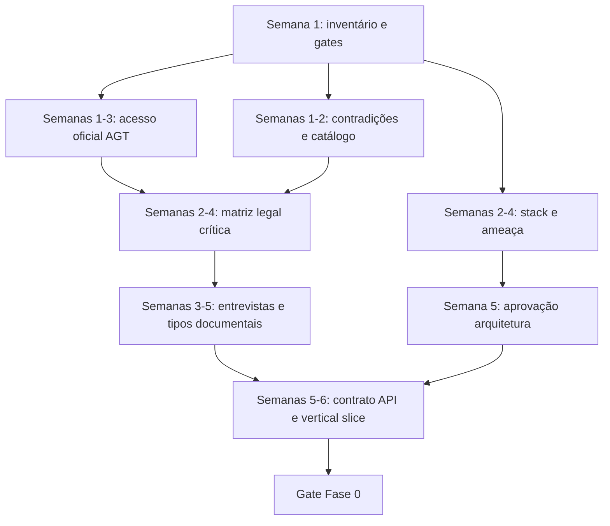

# Plano de execução — Fase 0 (Descoberta)

**Estado:** rascunho executável  
**Data:** 2026-07-20  
**Premissa ativa:** `ASM-REG-001` (não alterada nesta fase)  
**Âmbito:** planeamento, compliance e fundações documentais — **sem código de produção**  
**Duração estimada:** 6 semanas (intervalo roadmap: 4–8 semanas; ver [implementation-roadmap.md](implementation-roadmap.md))

## Objetivo

Fechar o suficiente de conformidade, decisões técnicas e contrato para entrar na Fase 1 com um vertical slice repetível, sem inventar regras fiscais e sem declarar conformidade de produção.

## Fontes de verdade utilizadas

1. [requirements-catalog.md](../01-compliance/requirements-catalog.md)
2. ADRs em [../02-architecture/adrs/](../02-architecture/adrs/)
3. [openapi.yaml](../../specs/openapi/openapi.yaml) (esqueleto; alterações só com justificação)
4. [domain-model.md](../04-domain/domain-model.md)
5. Lacunas em [regulatory-gaps.md](../01-compliance/regulatory-gaps.md)
6. Decisões em [open-decisions.md](open-decisions.md)

## Sequência de atividades

### Semana 1 — Arranque e inventário

| Atividade | Dependências | Responsável sugerido | Entregável |
|---|---|---|---|
| Confirmar entidade legal produtora e NIF angolano | — | Product Owner + Jurídico | Registo interno (fora do Git) |
| Nomear responsáveis portal AGT, compliance e chaves | Entidade confirmada | Direção | RACI Fase 0 |
| Inventariar fontes oficiais e estado de acesso | [sources.md](../01-compliance/sources.md) | Compliance | Atualização do registo de consulta |
| Classificar material em `local/` (consulta apenas) | [regulatory-gaps.md](../01-compliance/regulatory-gaps.md) | Compliance | Entrada no inventário de lacunas |
| Listar contradições documentais | Auditoria Fase 0 | Arquitetura + Compliance | Secção «Contradições» abaixo |

### Semanas 1–3 — Acesso oficial (paralelo crítico)

| Atividade | Dependências | Responsável sugerido | Entregável |
|---|---|---|---|
| Registo como produtora de software | NIF/entidade | Compliance | Pedido submetido |
| Pedido de credenciais de homologação | Canal oficial AGT | Compliance | Ticket/pedido; credenciais em cofre |
| Obter PDF oficial Decreto Executivo n.º 74/19 + rectificação | Fonte Diário da República / AGT | Compliance | Artefacto com hash SHA-256 (área controlada) |
| Snapshot versionado da documentação técnica FE pública | URL oficial FE | Engenharia + Compliance | Manifesto + cópia datada |
| Confirmar Modelo 8 e XSD SAF-T (AO) na área autenticada | Credenciais produtor | Compliance | Estado: obtido / pendente / bloqueado |

**Gate regulatório G0-R1:** PDF oficial 74/19 + rectificação arquivados com hash, **ou** bloqueio explícito documentado se a fonte oficial continuar inacessível (sem substituir por fonte comunitária).

### Semanas 2–4 — Catálogo e matriz

| Atividade | Dependências | Responsável sugerido | Entregável |
|---|---|---|---|
| Extrair requisitos do 74/19 oficial para a matriz | G0-R1 | Compliance | Linhas `AO-*` validadas ou «pendente fonte» |
| Completar catálogo crítico (`AO-ID-*`, `AO-DOC-*`, `AO-SEQ-*`, `AO-IDEM-*`, `AO-TAX-*`, `AO-CRYPTO-*`, `AO-AGT-*`, `AO-OFF-*`) | Fontes oficiais | Compliance + Domínio | [requirements-catalog.md](../01-compliance/requirements-catalog.md) atualizado |
| Preencher matriz de rastreabilidade para requisitos críticos | Catálogo | Compliance | [traceability-template.md](../01-compliance/traceability-template.md) populado |
| Elaborar perguntas formais à AGT sobre `ASM-REG-001` | Premissa produto | Compliance + Jurídico | Carta/perguntas (sem alterar a premissa) |
| Definir lista mínima de tipos documentais do MVP | Entrevistas + fontes | Produto + Compliance | Decisão registada em open-decisions |

### Semanas 2–5 — Entrevistas e produto

| Atividade | Dependências | Responsável sugerido | Entregável |
|---|---|---|---|
| Entrevistar 2–3 software houses de POS | Script de perguntas | Produto | Notas e requisitos de integração |
| Fechar fluxo de contingência **ao nível de produto** (limites legais ainda dependem de fonte oficial) | `AO-OFF-001`, `AO-OFF-002` | Compliance + Produto | Decisão ou «bloqueado por lacuna» |
| Validar fronteira POS/módulo com integradores | `ADR-0001`, `ASM-REG-001` | Produto | Checklist alinhado a [integration-lifecycle.md](../03-api/integration-lifecycle.md) |

### Semanas 2–5 — Arquitetura e stack (sem implementar)

| Atividade | Dependências | Responsável sugerido | Entregável |
|---|---|---|---|
| Rever ADRs 0001–0003 e ameaça inicial | Documentação existente | Arquitetura | Confirmação ou novos ADRs (só se necessário) |
| Aprovar proposta de stack (máx. 2 alternativas) | [technical-stack-proposal.md](technical-stack-proposal.md) | Arquitetura + Tech Lead | Decisão DEC-STACK-001 |
| Evoluir threat model para sessão STRIDE preliminar | [threat-model.md](../05-security/threat-model.md) | Segurança | Ameaças priorizadas Fase 1 |
| Definir critérios do primeiro vertical slice | [first-vertical-slice.md](first-vertical-slice.md) | Engenharia + Produto | Aceitação Fase 1 pronta |

### Semanas 5–6 — Contrato e gate

| Atividade | Dependências | Responsável sugerido | Entregável |
|---|---|---|---|
| Justificar alterações necessárias ao OpenAPI (sem as aplicar se ainda houver decisão em aberto) | Contradições + entrevistas | API Owner | Lista de mudanças propostas |
| Preparar estrutura `compliance/sources-manifest.yaml` (conteúdo público apenas) | [official-access-plan.md](../01-compliance/official-access-plan.md) | Engenharia | Manifesto inicial versionável |
| Review de readiness Fase 0 | Todos os gates abaixo | PO + Arquitetura + Compliance | Ata de conclusão |

## Dependências críticas

| Dependência | Bloqueia | Mitigação se atrasar |
|---|---|---|
| Credenciais / registo AGT | Homologação real, Modelo 8, XSD oficial | Prosseguir com simulador e documentação pública; não declarar conformidade |
| PDF oficial 74/19 + rectificação | Assinatura legal, menções, numeração normativa | Manter requisitos em «rascunho»; não extrair regras do PDF de proposta em `local/` como normativas |
| Confirmação `ASM-REG-001` | Modelo comercial de certificação | Manter premissa; desenhar fronteira demonstrável no dossier |
| Decisão de stack | Scaffold Fase 1 | Usar proposta recomendada após DEC-STACK-001 |
| Tipos documentais MVP | OpenAPI e pacote Angola | Limitar vertical slice a fatura simples |

## Responsáveis sugeridos (RACI resumido)

| Papel | Responsabilidades Fase 0 |
|---|---|
| Product Owner | Prioridade, entrevistas, gate de conclusão |
| Compliance / Jurídico-fiscal | Fontes oficiais, matriz, perguntas AGT, `ASM-REG-001` |
| Arquitetura | ADRs, stack, vertical slice, contradições técnicas |
| Engenharia (Tech Lead) | Viabilidade Edge/cloud, plano de testes, manifesto |
| Segurança | Threat model, gestão de segredos (processo) |
| Operações | Ambientes, RPO/RTO alvo para discussão |

## Entregáveis da Fase 0

1. Catálogo crítico `AO-*` com estados honestos (rascunho / validado / pendente fonte).
2. Matriz de rastreabilidade preenchida para requisitos críticos.
3. [regulatory-gaps.md](../01-compliance/regulatory-gaps.md) atualizado com evidências.
4. Decisões fechadas ou com prazo: ver [open-decisions.md](open-decisions.md).
5. Stack aprovada (documento; sem scaffold obrigatório nesta fase).
6. Definição do [first-vertical-slice.md](first-vertical-slice.md) com critérios de aceitação.
7. Lista justificada de mudanças OpenAPI para Fase 1 (ficheiro ainda não alterado sem justificação).
8. Perguntas formais à AGT sobre `ASM-REG-001` e contingência.
9. Changelog e links internos válidos.

**Fora do âmbito da Fase 0:** código de produção, microserviços, implementação do vertical slice, integração oficial AGT, gerador SAF-T de produção, Cabo Verde.

## Critérios de conclusão

A Fase 0 só fecha quando:

1. Requisitos críticos têm fonte, interpretação ou marcação explícita «pendente fonte oficial».
2. Lacunas regulatórias estão inventariadas com evidência necessária para fecho.
3. `ASM-REG-001` permanece como premissa de produto; o pedido de validação junto da AGT está documentado.
4. Stack recomendada está aprovada ou rejeitada com alternativa.
5. Vertical slice está especificado (aceitação + cenários de falha).
6. Contradições conhecidas estão registadas e têm dono.
7. Nenhum segredo, credencial ou dado fiscal real entrou no repositório.
8. Gate técnico e regulatório abaixo passam ou têm waivers datados e assinados.

## Gates

### Regulatórios

| Gate | Critério | Se falhar |
|---|---|---|
| G0-R1 | Decreto 74/19 + rectificação oficiais com hash | Não validar requisitos de assinatura/menções como «implementáveis» |
| G0-R2 | Pedido formal de acesso produtor / homologação enviado | Fase 1 só com simulador AGT |
| G0-R3 | Posição registada sobre `ASM-REG-001` (pedido feito; resposta pode estar pendente) | Continuar arquitetura; não alterar premissa |
| G0-R4 | XSD SAF-T (AO) oficial classificado (obtido ou lacuna bloqueante) | SAF-T permanece fora do vertical slice |

### Técnicos

| Gate | Critério | Se falhar |
|---|---|---|
| G0-T1 | ADR-0001/0002/0003 confirmados | Novo ADR antes da Fase 1 |
| G0-T2 | DEC-STACK-001 decidida | Não iniciar scaffold |
| G0-T3 | Vertical slice aceite por Produto + Engenharia | Replanejar Fase 1 |
| G0-T4 | Contradições OpenAPI/estados têm plano de resolução | Não «finalizar» contrato v1 |

## Estimativas (semanas)

| Bloco | Semanas | Notas |
|---|---:|---|
| Inventário, RACI, contradições | 1 | Paralelo com acesso AGT |
| Acesso oficial e artefactos | 2–4 | Caminho crítico externo |
| Matriz legal crítica | 2–3 | Depende de G0-R1 |
| Entrevistas e tipos documentais | 2 | Pode sobrepor-se |
| Stack, ameaça, vertical slice | 2 | Sem implementação |
| Gate e documentação final | 1 | Inclui review |
| **Total Fase 0** | **4–8** | Alvo interno: **6** |

## Contradições encontradas na documentação (auditoria)

| ID | Descrição | Ficheiros | Impacto | Dono sugerido |
|---|---|---|---|---|
| CTX-001 | Estado `cancelled` referido nas diretrizes da API, mas ausente do OpenAPI e da máquina de estados | [api-guidelines.md](../03-api/api-guidelines.md), [openapi.yaml](../../specs/openapi/openapi.yaml), [document-state-machine.md](../04-domain/document-state-machine.md) | Contrato inconsistente | API Owner |
| CTX-002 | Modelo de domínio admite dinheiro externo como «string/JSON number conforme contrato final»; OpenAPI já fixa `Money` como string | [domain-model.md](../04-domain/domain-model.md), OpenAPI | Ambiguidades de SDK | Domínio |
| CTX-003 | `quantity` no OpenAPI reutiliza schema `Money` (unidades monetárias ≠ quantidade) | OpenAPI | Validação incorreta | API Owner |
| CTX-004 | Roadmap Fase 0 pede «contrato API rascunhado»; já existe esqueleto `0.1.0-draft` | [implementation-roadmap.md](implementation-roadmap.md), OpenAPI | Critério de gate a clarificar | PO |
| CTX-005 | Fontes afirmam «existência confirmada» do 74/19, mas o PDF oficial ainda não está arquivado; o ficheiro em `local/` é **proposta** de 2018, não o diploma publicado | [sources.md](../01-compliance/sources.md), `local/docs/minfin055809.pdf` (consulta) | Risco de tratar proposta como norma | Compliance |

Estas contradições **não** são resolvidas silenciosamente nesta fase; ver [open-decisions.md](open-decisions.md).

## Relação com fases seguintes

- **Fase 1** implementa o [first-vertical-slice.md](first-vertical-slice.md) e evolui o OpenAPI com justificação.
- **Fase 2+** só declara conformidade de produção após fecho das lacunas em [regulatory-gaps.md](../01-compliance/regulatory-gaps.md).

## Referências

- [angola-compliance.md](../01-compliance/angola-compliance.md)
- [official-access-plan.md](../01-compliance/official-access-plan.md)
- [system-architecture.md](../02-architecture/system-architecture.md)
- [backlog-initial.md](backlog-initial.md)
- [testing-strategy.md](testing-strategy.md)
