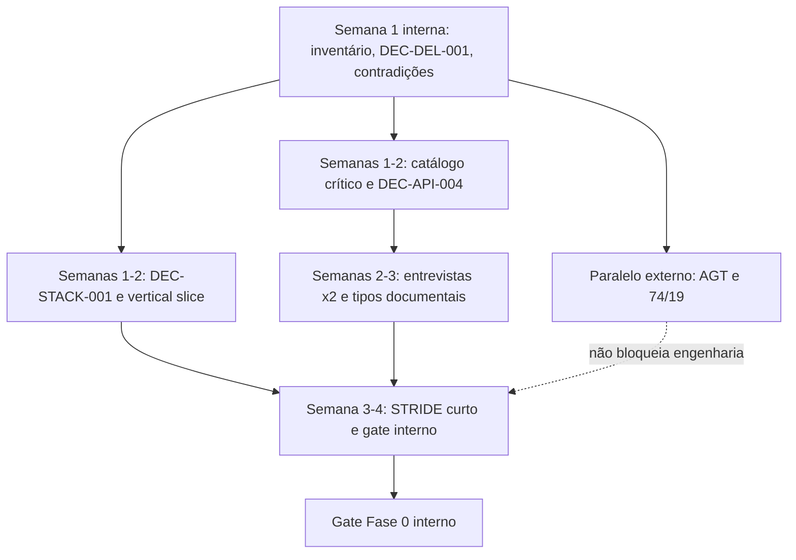

# Plano de execução — Fase 0 (Descoberta)

**Estado:** rascunho executável  
**Data:** 2026-07-20  
**Premissa ativa:** `ASM-REG-001` (não alterada nesta fase)  
**Âmbito:** planeamento, compliance e fundações documentais — **sem código de produção**  
**Esforço interno alvo:** 2–4 semanas (espera AGT em paralelo, sem ocupar engenharia)

## Objetivo

Fechar o mínimo de conformidade, decisões técnicas e contrato para entrar na Fase 1 com um vertical slice repetível, sem inventar regras fiscais e sem declarar conformidade de produção.

## Fontes de verdade utilizadas

1. [requirements-catalog.md](../01-compliance/requirements-catalog.md)
2. ADRs em [../02-architecture/adrs/](../02-architecture/adrs/)
3. [openapi.yaml](../../specs/openapi/openapi.yaml) (esqueleto; alterações só com justificação)
4. [domain-model.md](../04-domain/domain-model.md)
5. Lacunas em [regulatory-gaps.md](../01-compliance/regulatory-gaps.md)
6. Decisões em [open-decisions.md](open-decisions.md)

## Princípio de esforço

- Separar **trabalho interno** (engenharia/produto) de **espera externa** (AGT, diplomas, credenciais).
- Pedidos à AGT e arquivo de diplomas correm em paralelo; não alongar a Fase 0 com idle de engenharia.
- Não criar documentação adicional sem fechar uma decisão ou requisito.
- Entrevistas: no máximo **duas** software houses nesta fase.
- STRIDE: sessão **curta**, focada no vertical slice.
- Primeira implementação (Fase 1): **sem portal frontend**; POS demo = CLI ou coleção de requests.

## Sequência de atividades

### Semana 1 — Arranque interno

| Atividade | Dependências | Responsável sugerido | Entregável |
|---|---|---|---|
| Confirmar entidade legal produtora e NIF angolano | — | Product Owner + Jurídico | Registo interno (fora do Git) |
| Nomear responsáveis portal AGT, compliance e chaves | Entidade confirmada | Direção | RACI Fase 0 |
| Inventariar fontes oficiais e estado de acesso | [sources.md](../01-compliance/sources.md) | Compliance | Atualização do registo de consulta |
| Classificar material em `local/` (consulta apenas) | [regulatory-gaps.md](../01-compliance/regulatory-gaps.md) | Compliance | Entrada no inventário de lacunas |
| Fechar DEC-DEL-001 (gate OpenAPI) | Esqueleto existente | Product Owner | Decisão registada |
| Listar contradições documentais | Auditoria já feita | Arquitetura + Compliance | Secção «Contradições» abaixo |

### Paralelo externo (não conta como carga de engenharia)

| Atividade | Dependências | Responsável sugerido | Entregável |
|---|---|---|---|
| Registo como produtora de software | NIF/entidade | Compliance | Pedido submetido |
| Pedido de credenciais de homologação | Canal oficial AGT | Compliance | Ticket/pedido; credenciais em cofre |
| Obter PDF oficial Decreto Executivo n.º 74/19 + rectificação | Fonte Diário da República / AGT | Compliance | Artefacto com hash SHA-256 (área controlada) |
| Snapshot versionado da documentação técnica FE pública | URL oficial FE | Compliance (+ apoio pontual engenharia) | Manifesto + cópia datada |
| Confirmar Modelo 8 e XSD SAF-T (AO) na área autenticada | Credenciais produtor | Compliance | Estado: obtido / pendente / bloqueado |

**Gate regulatório G0-R1:** PDF oficial 74/19 + rectificação arquivados com hash, **ou** bloqueio explícito documentado. A ausência deste gate **não** impede fecho interno da Fase 0 com waivers; impede validar requisitos de assinatura/menções como implementáveis.

### Semanas 1–3 — Catálogo, decisões e produto (interno)

| Atividade | Dependências | Responsável sugerido | Entregável |
|---|---|---|---|
| Extrair requisitos do 74/19 oficial **quando disponível** | G0-R1 | Compliance | Linhas `AO-*` validadas ou «pendente fonte» |
| Completar catálogo crítico com estados honestos | Fontes disponíveis | Compliance + Domínio | [requirements-catalog.md](../01-compliance/requirements-catalog.md) |
| Preencher matriz só para requisitos desbloqueados | Catálogo | Compliance | [traceability-template.md](../01-compliance/traceability-template.md) |
| Elaborar perguntas formais à AGT sobre `ASM-REG-001` | Premissa produto | Compliance + Jurídico | Carta/perguntas |
| Abrir/conduzir DEC-API-004 (momento jurídico da emissão) | Doc FE pública + lacunas | Compliance + API Owner | Decisão ou «bloqueada-por-lacuna» |
| Definir lista mínima de tipos documentais do MVP | Até 2 entrevistas + fontes | Produto + Compliance | DEC-REG-003 |
| Entrevistar **duas** software houses de POS | Script curto | Produto | Notas focadas na fronteira POS/módulo |

### Semanas 1–3 — Arquitetura e stack (sem implementar)

| Atividade | Dependências | Responsável sugerido | Entregável |
|---|---|---|---|
| Rever ADRs 0001–0003 | Documentação existente | Arquitetura | Confirmação |
| Aprovar DEC-STACK-001 (Go / PG cloud / SQLite Edge) | [technical-stack-proposal.md](technical-stack-proposal.md) | Arquitetura + Tech Lead | Decisão |
| STRIDE curto focado no vertical slice | [first-vertical-slice.md](first-vertical-slice.md) | Segurança | Lista curta de ameaças do slice |
| Fechar especificação do vertical slice | Decisões acima | Engenharia + Produto | Aceitação Fase 1 |

### Semana 3–4 — Gate interno

| Atividade | Dependências | Responsável sugerido | Entregável |
|---|---|---|---|
| Lista de correções OpenAPI antes da implementação (sem editar o YAML agora) | DEC-DEL-001, DEC-API-* | API Owner | Lista versionada |
| Manifesto mínimo `compliance/sources-manifest.yaml` **só se** houver artefacto oficial novo | [official-access-plan.md](../01-compliance/official-access-plan.md) | Engenharia | Manifesto ou adiamento explícito |
| Review de readiness Fase 0 | Gates abaixo | PO + Arquitetura + Compliance | Ata de conclusão |

## Dependências críticas

| Dependência | Bloqueia | Mitigação se atrasar |
|---|---|---|
| Credenciais / registo AGT | Homologação real, Modelo 8, XSD oficial | Simulador AGT; engenharia não espera idle |
| PDF oficial 74/19 + rectificação | Assinatura legal normativa, menções | Requisitos em «rascunho»; não usar proposta em `local/` como norma |
| Confirmação `ASM-REG-001` | Modelo comercial de certificação | Manter premissa; pedido documentado |
| DEC-API-004 | Semântica de estados «emitido» vs «aceite» | Terminologia neutra no slice (`sealed_locally` / `prepared_for_submission`) |
| DEC-STACK-001 | Scaffold Fase 1 | Usar recomendação do documento de stack |
| Tipos documentais MVP | Âmbito do slice | Fatura simples |

## Responsáveis sugeridos (RACI resumido)

| Papel | Responsabilidades Fase 0 |
|---|---|
| Product Owner | Prioridade, 2 entrevistas, gate interno |
| Compliance / Jurídico-fiscal | Fontes oficiais, matriz, perguntas AGT, `ASM-REG-001` |
| Arquitetura | ADRs, stack, vertical slice, DEC-API-004 com compliance |
| Engenharia (Tech Lead) | Viabilidade Edge/cloud, testes do slice |
| Segurança | STRIDE curto do slice, gestão de segredos (processo) |

## Entregáveis da Fase 0

1. Catálogo crítico `AO-*` com estados honestos (rascunho / validado / pendente fonte).
2. Matriz preenchida **apenas** onde a fonte permite.
3. [regulatory-gaps.md](../01-compliance/regulatory-gaps.md) mantido.
4. Decisões prioritárias tratadas: ver [open-decisions.md](open-decisions.md).
5. Stack recomendada atualizada (Go + PG cloud + SQLite Edge).
6. [first-vertical-slice.md](first-vertical-slice.md) enxuto (sem portal, webhooks, frontend POS).
7. Lista justificada de correções OpenAPI para a primeira revisão contratual (YAML ainda não alterado).
8. Perguntas formais à AGT sobre `ASM-REG-001` (envio; resposta pode ficar pendente).

**Fora do âmbito da Fase 0:** código de produção, microserviços, implementação do vertical slice, portal, webhooks, integração oficial AGT, SAF-T de produção, Cabo Verde, documentação especulativa.

## Critérios de conclusão (gate interno)

1. Requisitos críticos têm fonte, interpretação ou «pendente fonte oficial».
2. Lacunas regulatórias inventariadas; espera AGT não bloqueia o gate interno se waivers existirem.
3. `ASM-REG-001` intacta; pedido de validação documentado.
4. DEC-STACK-001, DEC-DEL-001, DEC-API-001 e DEC-API-003 fechadas conforme [open-decisions.md](open-decisions.md).
5. DEC-API-004 aberta ou bloqueada-por-lacuna, com terminologia neutra acordada para o slice.
6. Vertical slice especificado (aceitação + falhas; at-least-once + idempotência).
7. Nenhum segredo ou dado fiscal real no repositório.

## Gates

### Regulatórios (podem ficar pendentes com waiver)

| Gate | Critério | Se falhar |
|---|---|---|
| G0-R1 | Decreto 74/19 + rectificação oficiais com hash | Não validar assinatura/menções legais como implementáveis |
| G0-R2 | Pedido formal de acesso produtor / homologação enviado | Fase 1 só com simulador AGT |
| G0-R3 | Pedido sobre `ASM-REG-001` enviado (resposta pode pendente) | Continuar; não alterar premissa |
| G0-R4 | XSD SAF-T (AO) classificado | SAF-T fora do vertical slice |

### Técnicos (gate interno)

| Gate | Critério | Se falhar |
|---|---|---|
| G0-T1 | ADR-0001/0002/0003 confirmados | Novo ADR antes da Fase 1 |
| G0-T2 | DEC-STACK-001 decidida | Não iniciar scaffold |
| G0-T3 | Vertical slice aceite | Replanejar Fase 1 |
| G0-T4 | DEC-DEL-001 decidida + lista de correções OpenAPI | Não fingir contrato «final» |
| G0-T5 | Política de numeração do slice alinhada a exclusão por série (sem «zero buracos» genérico) | Rever [first-vertical-slice.md](first-vertical-slice.md) |

## Estimativas

| Bloco | Esforço interno | Espera externa |
|---|---|---|
| Inventário, RACI, DEC-DEL-001 | 3–5 dias | — |
| Catálogo crítico + DEC-API-004 (com o disponível) | 1–2 semanas | Depende de 74/19 |
| 2 entrevistas + tipos documentais | 3–5 dias | Agendamento parceiros |
| Stack, STRIDE curto, vertical slice | 3–5 dias | — |
| Gate e ata | 1–2 dias | — |
| Registo AGT / diplomas / credenciais | Apoio pontual | **2–8+ semanas** (fora do caminho crítico de engenharia) |
| **Alvo Fase 0 interna** | **2–4 semanas** | Paralelo |

## Contradições encontradas na documentação (auditoria)

| ID | Descrição | Ficheiros | Impacto | Dono sugerido | Estado |
|---|---|---|---|---|---|
| CTX-001 | Estado `cancelled` nas diretrizes, ausente do OpenAPI e da máquina de estados | [api-guidelines.md](../03-api/api-guidelines.md), OpenAPI, [document-state-machine.md](../04-domain/document-state-machine.md) | Contrato inconsistente | API Owner | Aberto (DEC-API-002) |
| CTX-002 | Domínio admite string/JSON number; OpenAPI usa string `Money` | [domain-model.md](../04-domain/domain-model.md), OpenAPI | Ambiguidades de SDK | Domínio | **Resolvido em decisão** (DEC-API-001); OpenAPI formal na 1.ª revisão |
| CTX-003 | `quantity` reutiliza schema `Money` | OpenAPI | Validação incorreta | API Owner | **Resolvido em decisão** (DEC-API-003); alteração YAML adiada |
| CTX-004 | Roadmap pede «contrato rascunhado»; já existe `0.1.0-draft` | [implementation-roadmap.md](implementation-roadmap.md), OpenAPI | Critério de gate | PO | **Resolvido** (DEC-DEL-001) |
| CTX-005 | «74/19 confirmado» sem PDF oficial; `local/` tem proposta 2018 | [sources.md](../01-compliance/sources.md), `local/` | Risco normativo | Compliance | Aberto (DEC-REG-002) |
| CTX-006 | OpenAPI/diretrizes usam `fiscally_issued` antes da aceitação AGT; semântica jurídica não fechada | OpenAPI, máquina de estados, slice | Risco de interpretação errada | Compliance + API Owner | Aberto (DEC-API-004); slice usa termos neutros |

## Relação com fases seguintes

- **Fase 1** implementa o [first-vertical-slice.md](first-vertical-slice.md) (API mínima, CLI/coleção, simulador; sem portal/webhooks).
- **Fase 2+** declara conformidade de produção só após fecho das lacunas em [regulatory-gaps.md](../01-compliance/regulatory-gaps.md).

## Referências

- [angola-compliance.md](../01-compliance/angola-compliance.md)
- [official-access-plan.md](../01-compliance/official-access-plan.md)
- [system-architecture.md](../02-architecture/system-architecture.md)
- [backlog-initial.md](backlog-initial.md)
- [testing-strategy.md](testing-strategy.md)
- [technical-stack-proposal.md](technical-stack-proposal.md)
- [open-decisions.md](open-decisions.md)
